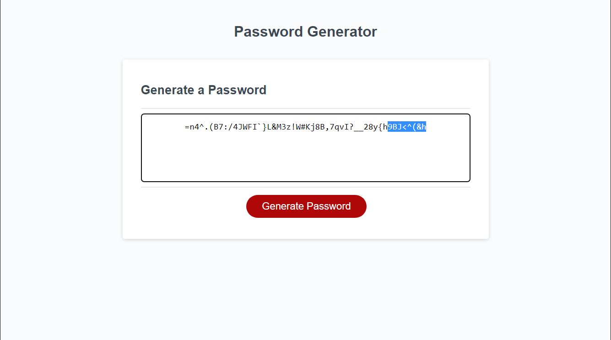

# Tybalt Mallet's Personal Portfolio Module 2

## Description
This is the Module 3 challenge for the third week of the UCB Coding Bootcamp. For this challenge we were asked to create a code that would generate a password for a user based on their desired specifications (i.e. length of password, and which characters to use) on a website using Javascript. Using a combination of all the tools we learned this week in class, such as variables if statements, for loops, as well as the default alert, prompt, confirm, and random generator methods and functions in JavaScript the code creates a unique database of characters to select from based on the users criteria, and returns a completely random selection of them to the user as a complete password, through both an alert, and written on the page in the appropriate position.
## Project Link

https://notuneeven.github.io/JavaScript-Password-Generator/

## Screenshot of Website

## Usage 

This website can be used as a way to, obviously, generate random passcodes, that are more secure, as often times when users create their own passwords, they are not completely random. Most people usually end up using the same passwords on multiple accounts, or using very common passcode creation methods such as using their last name, and their birthday, which leaves them vulnerable to potential hackers who know this information. It can also be used as a way for me to come back and look at some of the JavaScript methods we learned in our first week for studying later on!

## Credits 

N/A

## License 

N/A
